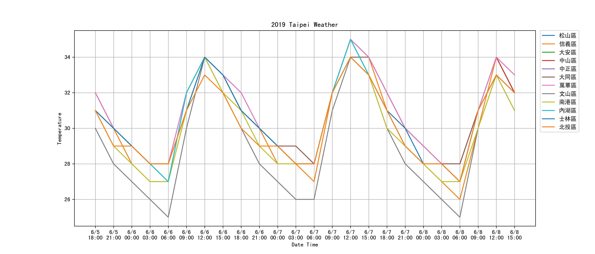

# taipei_weather

> 臺北天氣 折線圖 Matplotlib Pyplot

> For macOS

## Chinese font
https://www.itread01.com/content/1508747936.html

## Do before run
- env：`$ python3 -m venv env`
- run env：`$ . env/bin/activate`
- install packing：`$ pip3 install -r requirements.txt`

## Run
- run：`$ python3 main.py`

